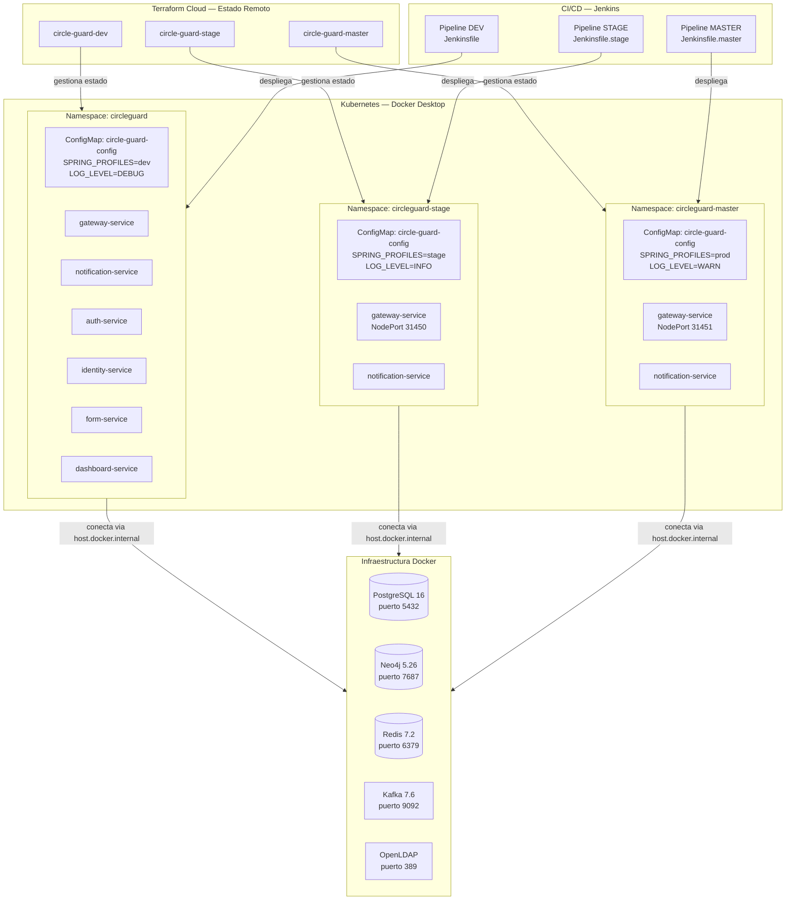
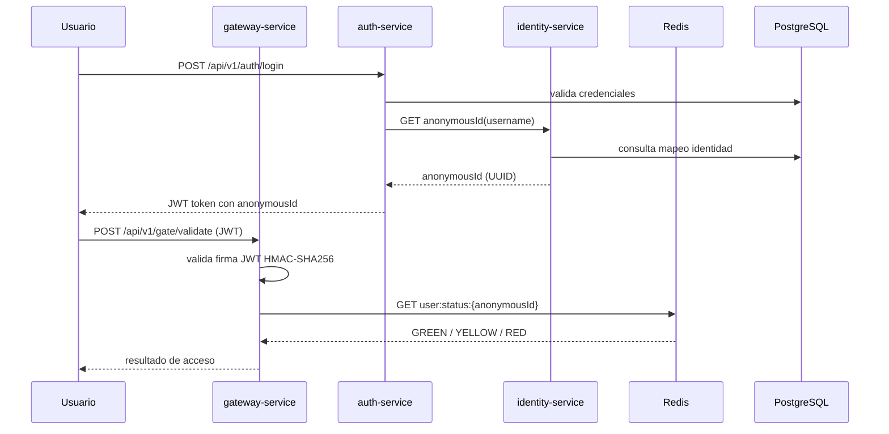
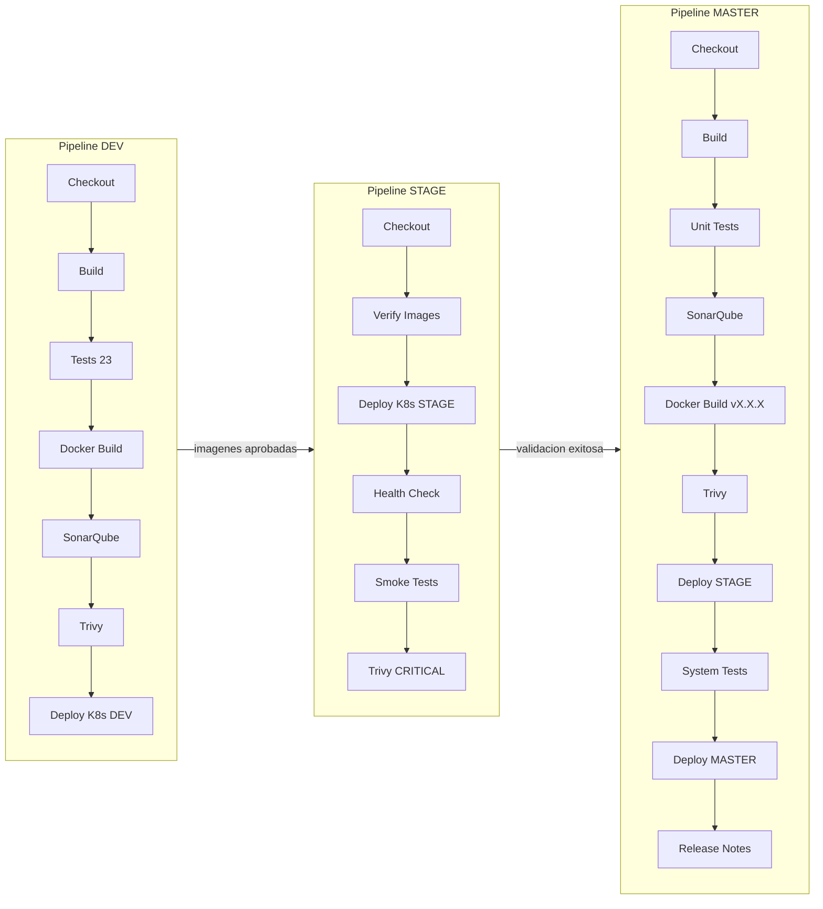
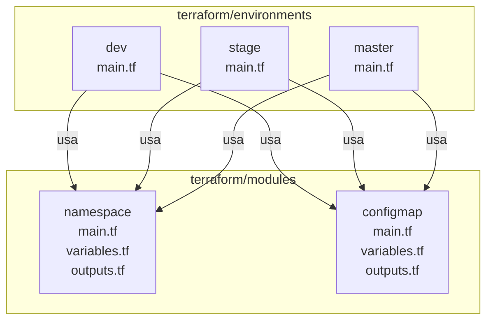

# Arquitectura de Infraestructura — Circle Guard

## Vision general

Circle Guard es un sistema de microservicios desplegado en Kubernetes con
tres ambientes separados gestionados por Terraform.

## Diagrama de infraestructura

## Diagrama de comunicacion entre microservicios

## Diagrama de pipeline CI/CD

## Modulos Terraform

## Stack tecnologico

| Capa | Tecnologia | Version | Proposito |
|------|-----------|---------|-----------|
| Orquestacion | Kubernetes | 1.32.2 | Despliegue de microservicios |
| IaC | Terraform | 1.14.6 | Gestion de infraestructura |
| Estado remoto | HCP Terraform Cloud | - | Estado compartido de Terraform |
| CI/CD | Jenkins | LTS | Pipelines automatizados |
| Calidad | SonarQube | LTS Community | Analisis estatico |
| Seguridad | Trivy | 0.70.0 | Escaneo de vulnerabilidades |
| Base de datos | PostgreSQL | 16 | Identidades y formularios |
| Grafo | Neo4j | 5.26 | Trazabilidad de contactos |
| Cache | Redis | 7.2 | Estado sanitario en tiempo real |
| Mensajeria | Apache Kafka | 7.6 | Eventos asincronos |
| Directorio | OpenLDAP | 1.5.0 | Autenticacion universitaria |

---
*Arquitectura documentada como parte del Proyecto Final — Ingenieria de Software V*
