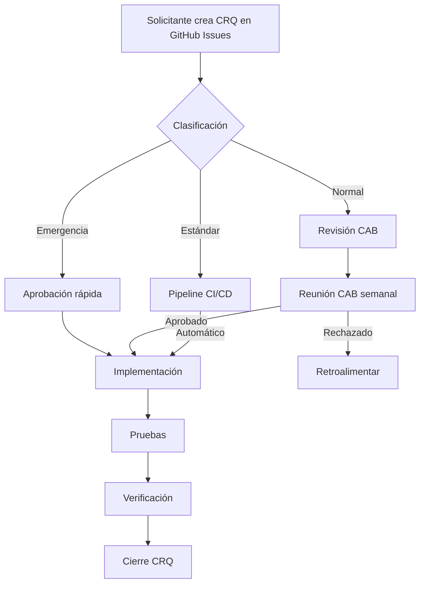

# Change Management — Circle Guard

## 1. Objetivo

Establecer un proceso formal para solicitar, evaluar, aprobar e implementar cambios en los servicios del sistema Circle Guard, minimizando riesgos e impacto en la disponibilidad.

## 2. Tipos de Cambio

| Tipo | Descripción | Requiere aprobación | Ventana de cambio |
|------|-------------|-------------------|-------------------|
| **Normal** | Nuevas funcionalidades, cambios de arquitectura, modificaciones mayores | CAB | Ventana programada (Sprint) |
| **Estándar** | Corrección de bugs, cambios de configuración, actualización de dependencias menores | Pipeline CI/CD | Cualquier día hábil |
| **Emergencia** | Hotfix de seguridad, caída de servicio crítico | Líder técnico + Product Owner | Inmediata, con post-mortem |
| **Cosmético** | Documentación, logging, cambios sin efecto en runtime | Ninguna | Cualquier momento |

## 3. Flujo de Solicitud de Cambio (CRQ)



### 3.1 Template de Change Request

```markdown
---
título: "[CRQ-XXX] Descripción del cambio"
fecha: YYYY-MM-DD
solicitante: Nombre
tipo: normal | estandar | emergencia | cosmetico
servicios_afectados: [lista de servicios]
riesgo: alto | medio | bajo
---
```

### 3.2 Campos del CRQ

- **ID único**: CRQ-XXX (auto-asignado por GitHub Issue)
- **Descripción**: Qué se cambia y por qué
- **Justificación**: Beneficio esperado
- **Servicios afectados**: auth, gateway, identity, form, notification, dashboard
- **Riesgo estimado**: Alto (cambia API pública), Medio (nueva dependencia), Bajo (config-only)
- **Plan de prueba**: Cómo se verificará el cambio
- **Plan de rollback**: Pasos para revertir
- **Ventana propuesta**: Fecha/hora deseada

## 4. Change Advisory Board (CAB)

| Rol | Persona | Responsabilidad |
|-----|---------|----------------|
| Product Owner | PO | Prioriza cambios, decide business impact |
| Líder Técnico | Tech Lead | Evalúa riesgo técnico y plan de rollback |
| DevOps | Admin | Revisa impacto en infraestructura |
| QA | Tester | Valida plan de pruebas |

### 4.1 Reuniones CAB

- **Frecuencia**: Semanal (cada lunes, 30 min)
- **Quorum**: Mínimo 2 de 4 miembros
- **Decisiones**: Aprobado, Rechazado, Aplazado (con feedback)
- **Registro**: Minuteado en GitHub Issue del CRQ

## 5. Evaluación de Riesgo

| Factor | Alto | Medio | Bajo |
|--------|------|-------|------|
| Servicios afectados | ≥3 servicios | 2 servicios | 1 servicio |
| Cambio de API | Sí (breaking) | Sí (extensivo) | No |
| Dependencias nuevas | ≥2 librerías | 1 librería | Ninguna |
| Impacto en datos | Migración BD | Nuevos campos | Sin datos |
| Tiempo de rollback | >30 min | 10-30 min | <10 min |

## 6. Ventanas de Cambio

- **Cambios normales**: Viernes 22:00–02:00 (GMT-5)
- **Cambios estándar**: Cualquier día hábil 08:00–18:00
- **Emergencia**: En cualquier momento con aprobación inmediata
- **Freeze**: Semana de navidad y año nuevo (solo emergencias)

## 7. Comunicación

| Audiencia | Cambio Normal | Cambio Emergencia |
|-----------|---------------|-------------------|
| Usuarios | 48h antes | Al aplicar |
| Stakeholders | 1 semana antes | 1h después |
| Equipo técnico | 2 días antes | Inmediato |

- **Canal**: Slack/E-mail según audiencia
- **Formato**: "CRQ-XXX: [título] — [fecha/hora] — [impacto esperado]"

## 8. Post-Implementation Review (PIR)

Después de cada cambio normal o emergencia:
1. ¿El cambio logró el objetivo?
2. ¿Hubo incidentes no planificados?
3. ¿El rollback funcionó correctamente?
4. Lecciones aprendidas
5. Actualizar documentación si aplica

## 9. Métricas de Change Management

| Métrica | Objetivo |
|---------|----------|
| Tasa de éxito de cambios | ≥90% |
| Cambios de emergencia / mes | ≤2 |
| Tiempo promedio de aprobación (normal) | ≤3 días |
| Rollbacks exitosos | 100% |

---

*Documento controlado — Versión 1.0 — Última actualización: 2026-06-11*
